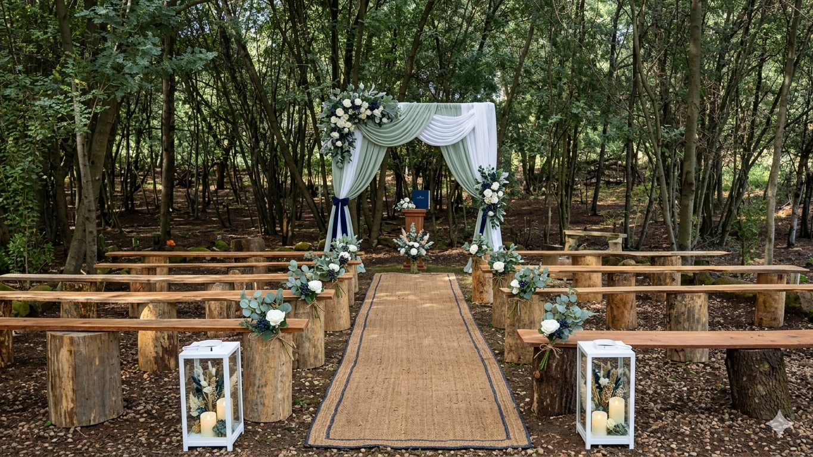
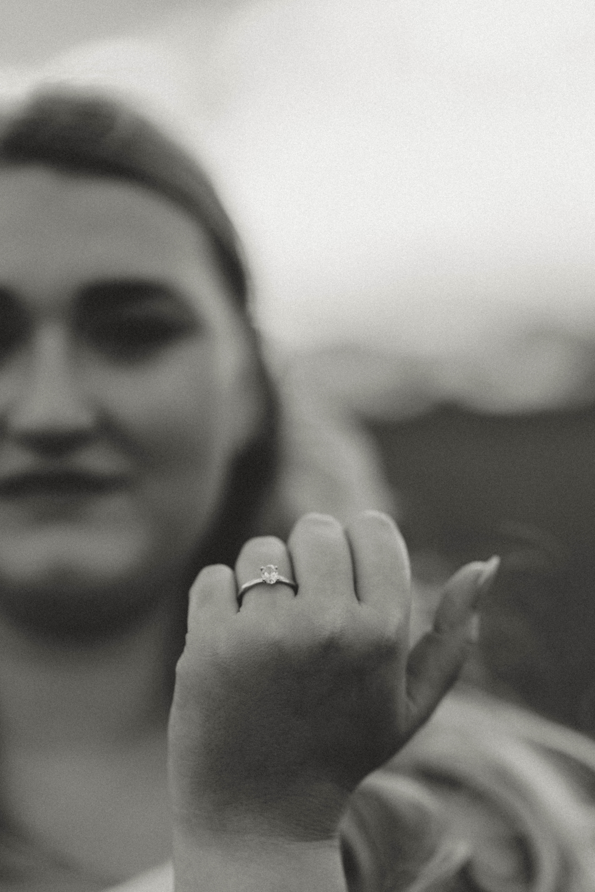

<!DOCTYPE html>
<html lang="en">
<head>
<meta charset="UTF-8" />
<meta name="viewport" content="width=device-width, initial-scale=1.0"/>
<title>Nathan & Janke · 27 March 2027</title>
<link rel="preconnect" href="https://fonts.googleapis.com">
<link rel="preconnect" href="https://fonts.gstatic.com" crossorigin>
<link href="https://fonts.googleapis.com/css2?family=Cormorant+Garamond:wght@400;500;600;700&family=Inter:wght@300;400;500&display=swap" rel="stylesheet">
<link rel="stylesheet" href="style.css">
</head>
<body>

<!-- HERO -->
<header class="hero">
  

    
Together with their families

    <h1 class="reveal delay-1">Nathan &amp; Janke</h1>
    
<small>27 · MARCH · 2027</small>

    
Bashewa · South Africa

    <a href="#invited" class="scroll-cue reveal delay-4">↓</a>
  

</header>

<!-- YOU'RE INVITED -->
<section id="invited" class="section invited">
  <h2 class="reveal">You're Invited</h2>
  
Dear Friends &amp; Family,

  

    With joyful hearts, we invite you to share in our wedding day as we say
    "I do" and begin our life together. Your presence would mean the world to us.
  

  
— Nathan &amp; Janke

</section>

<!-- VENUE / BRAAI -->
<section class="section venue">
  <h2 class="reveal">The Venue</h2>
  

    

      
      Venue photo
    

    

      <h3>Stofpad Skuur</h3>
      
Portion 32, Farm Rietfontein

      
Garsfontein Rd, Bashewa, 0084

      <h3 class="braai-heading">It's a Bring &amp; Braai 🔥</h3>
      

        Our celebration has a relaxed, South African heart — it's a
        <strong>bring &amp; braai</strong>. We'll provide a selection of
        side dishes, and the main meal will be the braai food we cook
        together on the day.
      

      

        Please bring along <strong>your own meat to braai</strong> and
        <strong>your own drinks</strong> to enjoy. Come hungry, come thirsty,
        and come ready to celebrate.
      

    

  

</section>

<!-- EVENT DETAILS -->
<section class="section details">
  <h2 class="reveal">Event Details</h2>
  

    

      <h3>Ceremony &amp; Reception</h3>
      
<strong>Saturday, 27 March 2027</strong>

      
Stofpad Skuur

      
Portion 32, Farm Rietfontein

      
Garsfontein Rd, Bashewa, 0084

      <a class="btn" target="_blank"
         href="https://www.google.com/maps/search/?api=1&query=Stofpad+Skuur+Garsfontein+Rd+Bashewa">
        Open in Google Maps
      </a>
    

    

      
      Photo placeholder
    

  

</section>

<!-- TRAVEL & ACCOMMODATION -->
<section class="section travel">
  <h2 class="reveal">Travel &amp; Accommodation</h2>
  

    There is a lodge available on or near the venue for guests who would
    like to stay over. For details on accommodation, directions, or any
    travel questions, please reach out to
    <strong>Janke</strong> or <strong>Nathan</strong> directly — we're happy to help.
  

</section>

<!-- DRESS CODE -->
<section class="section dresscode">
  <h2 class="reveal">Dress Code</h2>
  
Formal attire in our wedding palette:

  

    
Sage

    
Navy

    
Brown

  

  
Please avoid white — that one's reserved for the bride 😉

</section>

<!-- SCHEDULE -->
<section class="section schedule">
  <h2 class="reveal">Schedule</h2>
  
The timeline for the day is still being finalised. Please check back here closer to the date for the full schedule.

</section>

<!-- RSVP -->
<section class="section rsvp">
  <h2 class="reveal">RSVP</h2>
  
Kindly let us know if you'll be joining us by completing our RSVP form.

  <a class="btn btn-primary reveal" id="rsvp-link" href="#" target="_blank">Open RSVP Form</a>
  
<em>(RSVP link to be added — replace the URL in <code>script.js</code>.)</em>

</section>

<footer>
  
Nathan &amp; Janke · 27 March 2027 · Bashewa, South Africa

</footer>

</body>
</html>
